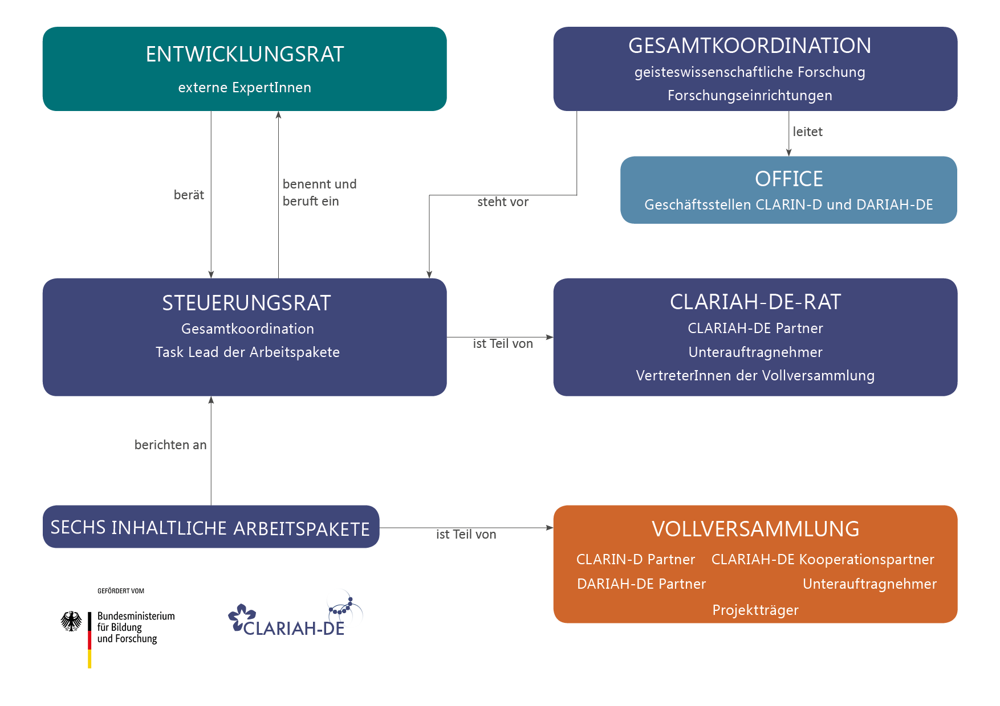
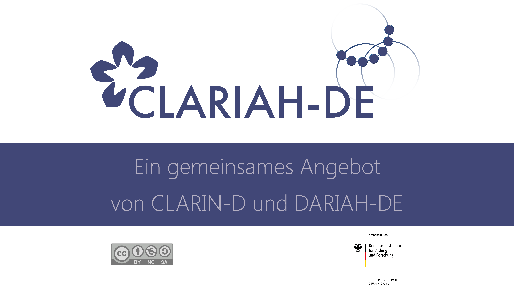

<small> Dr. Anne Klammt, SUB Göttingen</small>

<small>[www.clariah.de](https://www.clariah.de/)</small>
<small>[@CLARIAHde](https://twitter.com/CLARIAHde) </small>

---

### Ziele

*   Projekt gefördert durch das BMBF 

* Laufzeit 1. März 2019–31. März 2021

* Ziele des Verbunds <small>
    * CLARIAH-DE macht vorher getrennt bestehende Angebote gemeinsam verfügbar (DARIAH-DE und CLARIN-D)
    * Beitrag für die Geisteswissenschaften zur gemeinsamen Nationalen Forschungsdateninfrastruktur (NFDI)

</small>

---

### Arbeitspakete 1 und 2<!-- .element class="leftAligned" -->

#### AP 1 – Forschungsdaten, Standards und Verfahren<!-- .element class="leftAligned" -->
<small>Verantwortlich: Berlin-Brandenburgische Akademie der Wissenschaften (BBAW) & Otto-Friedrich-Universität Bamberg</small><!-- .element class="leftAligned" -->

#### AP 2 – Werkzeuge und virtuelle Forschungsumgebungen <!-- .element class="leftAligned" -->
<small>Verantwortlich: Technische Universität Darmstadt & Eberhard Karls Universität Tübingen</small><!-- .element class="leftAligned" -->

--

#### AP1 - Entwicklung gemeinsamer Standards und Verfahren zur Integration von Forschungsdaten 

* Zusammenführung und Homogenisierung digitaler Datenbestände 
* Aufbereitung von Beständen für bestehende Rechercheumgebungen
* Integration von Angeboten aus der Community
* Erstellung von Handreichungen und Empfehlungen
* Kooperation mit Standardisierungsgremien

--

#### AP2 - Große Werkzeuge und virtuelle Forschungsumgebungen 

* Identifikation von Werkzeugen und Diensten zur Integration 
* Datenformate zur gemeinsamen Nutzung 
* Identifikation von Synergieeffekten zwischen Werkzeugen 
* Switchboard-Erweiterungen 
* Herstellung von Interoperabilität zwischen TextGridRep und Switchboard 

---

### Arbeitspakete 3 und 4 <!-- .element class="leftAligned" -->

#### AP 3 – Kompetenzvermittlung und Nachwuchsförderung <!-- .element class="leftAligned" -->
<small>Verantwortlich: Universität Würzburg & Leibniz-Institut für Deutsche Sprache (IDS)</small> <!-- .element class="leftAligned" -->

#### AP 4 – Technische Vernetzung und Koordination der technischen Entwicklungen <!-- .element class="leftAligned" -->
<small>Verantwortlich: Universität Leipzig & Gesellschaft für wissenschaftliche Datenverarbeitung mbH Göttingen (GWDG)</small> <!-- .element class="leftAligned" -->

--

#### AP3 - Kompetenzvermittlung und Nachwuchsförderung

* Erstellung und Aggregation von Lehrmaterialien aus CLARIN-D, DARIAH-DE und externen Quellen
* Reisekostenbeihilfen
* Lehrveranstaltungen
    * Workshops <!-- .element class="smaller-list" -->
    * Doktorandentage <!-- .element class="smaller-list" -->
    * Sommerschulkurse <!-- .element class="smaller-list" -->

--

#### AP4 - Technische Vernetzung und Koordination der technischen Entwicklungen 

* Vernetzung und Zusammenführung von Technologien, Werkzeugen, Diensten und Abläufen 
* Koordination der gemeinsamen technischen Weiterentwicklung 

---

### Arbeitspakete 5 und 6 <!-- .element class="leftAligned" -->

#### AP 5 – Community-Engagement: Outreach/ Dissemination und Liaison <!-- .element class="leftAligned" -->
<small>Verantwortlich: Eberhard Karls Universität Tübingen & Niedersächsische Staats- und Universitätsbibliothek Göttingen</small> <!-- .element class="leftAligned" -->

#### AP 6 – Organisatorische Infrastruktur/Geschäftsstellen <!-- .element class="leftAligned" -->
<small>Verantwortlich: Niedersächsische Staats- und Universitätsbibliothek Göttingen & Eberhard Karls Universität Tübingen</small> <!-- .element class="leftAligned" -->

--

#### AP5 - Community-Engagement: Outreach/Dissemination und Liaison

* Entwicklung einer gemeinsamen Marke
* Zusammenführung der Web-Angebote
* Erstellung von Informationsmaterial

--

#### AP6 - Organisatorische Infrastruktur/Geschäftsstellen

* Aufbau und Unterstützung Betrieb eines gemeinsamen Helpdesk
* Aufbau einer Governance
* Administration und Organisation von Gremiensitzungen 
* Internationale Vernetzung 
* Gesamtkoordination
* Weiterentwicklung im NFDI Prozess

---

#### Governance  

<!-- .element class="huge-img" -->

---

### CLARIAH-DE: erste Schritte

* Kickoff-Treffen am 8.-9. April 2019 am IDS Mannheim

* Konstituierung von Arbeitsgruppen für die einzelnen Arbeitspakete

* Webseite ist online: [www.clariah.de](https://www.clariah.de/)

---

#### Website 

<iframe frameborder="0" width="100%" height="500pt" src="https://clariah.de"></iframe>

---

### CLARIAH-DE Vollversammlung

Erste CLARIAH-DE Vollversammlung am 14./15. November 2019 in Tübingen 

* alle am Projekt CLARIAH-DE beteiligten Partner 
* alle weiteren Partner aus CLARIN-D und DARIAH-DE
* disziplinäre Vertretungen, etwa die CLARIN-D-Facharbeitsgruppen

---

<!-- .element class="huge-img" -->

<small>Dr. Anne Klammt, SUB Göttingen</small>

<small>[www.clariah.de](https://www.clariah.de/)</small>
<small>[@CLARIAHde](https://twitter.com/CLARIAHde) </small>
